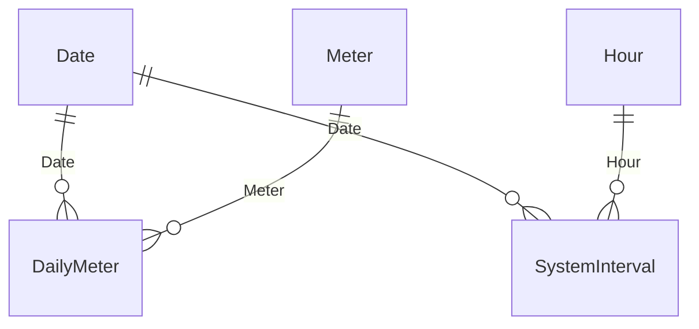

# Model and analytical contract

## Relationships

Scenario and CarbonFactor are deliberately disconnected. Filters flow from dimensions to facts only. No fact-to-fact relationship exists. The demand page has no customer slicer because it reports the complete portfolio. Date filters apply to both facts; Hour filters only the interval fact. The quality reconciliation should be evaluated with date filters, not hour or fact-column filters.

## Grain and units

DailyMeter has one row per interval-start date and meter. EnergyKWh is additive; PeakKW is nonadditive and excluded on DST dates. It is hidden and is not used to calculate portfolio peak. SystemInterval preserves original timestamp labels, with a Date and Hour derived by subtracting 15 minutes. SystemKW sums every customer's demand at exactly that interval. The portfolio peak is MAX of the interval totals; it is never SUM of individual customer maxima.

The timestamp convention is an explicit project assumption supported by the regular source boundaries, not a timestamp definition stated by UCI. No conversion to UTC is attempted. The source deliberately imposes 96 measurements per day despite clock changes.

## Quality treatments

UCI describes zeros before some clients were created, March clock-change zeros and October aggregated intervals. Zeros remain in energy totals. No blanket imputation, deletion or smoothing is applied. FirstPositiveDate is inferred from the first positive reading; it is not a confirmed service activation date. PreActivation flags entire dates strictly before that first positive date, so it does not count leading zeros on that date.

All eight European clock-change days are excluded from demand and load-factor measures, a conservative rule which removes 768 portfolio intervals. Their energy remains in consumption totals. ValidInterval counts therefore change with date selection. The demand averages and peaks always use the same valid interval set.

Night energy is interval-start hours 00:00–05:59. This is a simple screening window, not a tariff definition, baseload measurement or waste estimate. The source contains no operational hours, weather, site types or occupancy data to justify those interpretations.

YoY compares the selected calendar dates with the previous year. It may include onboarding effects; the report exposes first-positive-year cohort filtering. Do not present this as weather-normalized efficiency. The growth measure returns blank for multi-year selections or absent prior-year values; select one year for an annual comparison.

## Sustainability assumptions

CarbonFactor values 0.10–0.60 kg CO2e/kWh are illustrative scenario inputs. No factor is claimed to be the historical Portuguese grid intensity. With no single selection the factor defaults to 0.30; reduction defaults to 10%. Scenario options are 5%, 10%, 20%.

Illustrative tCO2e = energy MWh × assumed kg CO2e/kWh. The units are consistent because the kWh/MWh conversion and kg/tonne conversion cancel. Avoided emissions = illustrative baseline × reduction. These are conditional estimates, not achieved savings or an audited Scope 2 inventory. Carbon timing, rebound, generation mix, feasibility and contractual instruments are outside scope.

## Production extension

For a real deployment, land new interval batches in partitioned Parquet/lakehouse storage, validate timestamps and meter metadata, define approved calendar/carbon factors, then create incremental date partitions against a folding source. Keep simultaneous demand available when aggregating. Add ownership, monitored refresh, access controls, deployment stages and measured performance budgets based on actual business needs.
